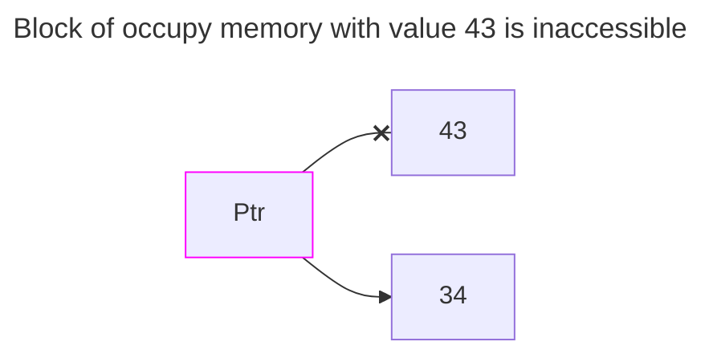
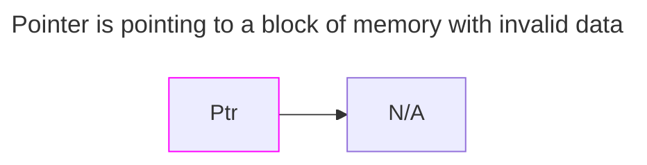

# Memory Leak

A Memory leak occurs when we leave inaccessible memory occupied.

```c++
{
...
int* Ptr = new int(43);
Ptr = new int(34); // This makes the block of memory with the previous data (number 43) inaccessible.
delete Ptr; // Memory is freed, no valid data at "Ptr" adress
}
```

``



---
# Dangling Pointer

A Dangling Pointer it's a pointer that points to a memory address that contains invalid data.

```c++
{
...
int* Ptr = new int(43);
delete Ptr; // Memory is freed, no valid data at "Ptr" adress

// Any attempt to manipulate data in the direction that "Ptr" is pointing to will result in a crash.
Print(*Ptr); // Undefined behavior, app gonna crash.
*Ptr = 34; // Undefined behavior, app gonna crash.
...
}
```


